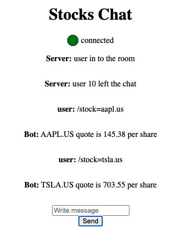

# Stocks Chat
Application to get the stocks price from an external API by a chat. 

## How the application looks


## How to run the application

### RabbitMQ
In order to create a RabbitMQ instance execute the following commands (docker installation is required):
```
docker run -it --rm --name rabbitmq -p 5672:5672 -p 15672:15672 rabbitmq:3-management
```
You can access to the RabbitMQ panel in this way:

```
http://localhost:15672
User: guest
Pass: guest
```
### Bot
The is a decoupled application that always is listening for calls, run the bot by:
```
cd .\bot\
go run .\main.go
```
The bot runs in localhost:8081, you should to see this confirmation message ```stocks bot listening on localhost:8081```

### Backend chat
The backend part for the chat is an API that exposes a couple of endpoints, you can run it by:
```
cd .\chat\
go run .\main.go
```
The chat service runs in localhost:8080, you should to see this confirmation message ```Chat listening on http://localhost:8080```

### `GET /health`
Endpoint to confirm the service is running:

### `GET /stock`
This endpoint consumes the external API, gets the information from the csv file and sends a message to RabbitMQ, receives a query parameter with the ticker in order to get the information of the stock, for instance ```http://localhost:8081/stock?ticker=APPL```

### Front chat
The frontend chat is a small React application, you can run it by:
```
cd .\chat\frontend\webchat
npm install
npm start

```
### Getting a stock price
You have to send a message using this format /stock=stock_ticker, for instance:
```
/stock=aapl.us
```